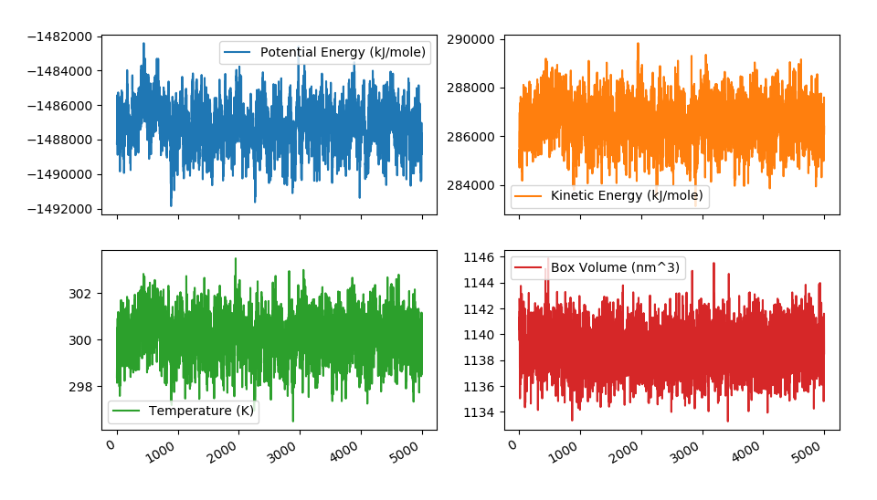

.. _usage:

===========
Quick usage
===========

OMMProtocol
===========

Once installed (:ref:`install`), first thing to do is creating the input file (:ref:`input`) for your simulation. This task usually involve two different steps:

1. Getting the structural data (topology, coordinates)
2. Specifying the simulation details:
    - Forcefield parameters
    - Solvation conditions: explicit, implicit, no solvent?
    - Simulation conditions: temperature, pressure, NPT, NVT?
    - Technical details: how to compute non-bonded interactions, whether to use periodic boundary conditions, whether to constrain some specific types of bonds, the integration method and timestep...

These details are probably out of the scope of this documentation, and the reader is encouraged to read specific tutorials about this, such as:

- `An Introduction to Molecular Dynamics Simulations using AMBER <http://ambermd.org/tutorials/basic/tutorial0/index.htm>`_
- `NAMD tutorials <http://www.ks.uiuc.edu/Training/Tutorials/namd-index.html>`_
- `GROMACS tutorials <http://www.bevanlab.biochem.vt.edu/Pages/Personal/justin/gmx-tutorials/>`_

With a correctly formed YAML input file named, for example, *simulation.yaml*, the user can now run:

::

    ommprotocol simulation.yaml

If the structure is correctly formed and the forcefield parameters are well defined, the screen will now display a status like this:

The generated files will be written to the directory specified in the ``outputpath`` key (or, if omitted, to the same directory *simulation.yaml* is in), with the following name format: ``[globalname]_[stagename].[extension]``, where ``globalname`` is the value of the global ``name`` key in the input file, and ``stagename`` is the value of the ``stage`` key in each stage.

Most of this files can be opened during the simulation. That way you can check the progress of the trajectory in viewers like VMD, PyMol or UCSF Chimera. Since .log files are created by default with some metadata about the simulation (temperature, potential energy, volume...), they are a convenient way of checking if everything is working OK. For example, the energies and temperatures should be more or less constant. To do that, a helper utility called ``ommanalyze`` is included, which is able to produce interactive plots of such properties:

OMMAnalyze
==========

``ommanalyze`` is a small collection of analysis utilities for topologies and trajectories. Currently, it offers three subcommands:

- ``ommanalyze log``: Plot *.log reports generated by OMMProtocol (energies, temperature, volume...).
- ``ommanalyze rmsd``: Performs RMSD analysis on trajectories. Produces plots and plain-text file. Since it uses MDTraj ``iterload``, it does not load all the files at once and allows you to analyze long trajectories with small memory footprint.
- ``ommanalyze top``: Quick summary of any topology supported by MDTraj. Designed to debug subset selection queries with ``--subset`` flag. Check ``mdinspect`` (provided by MDTraj) for more advanced debugging.

Examples
........

::

    > ommanalyze rmsd -t my_topology.prmtop -s 'backbone' my_trajectories*.dcd

     0%|                                                       | 0/26 [00:00<?, ?file/s]
    40%|█████▏       | 200/500 [00:02<00:03, 77.95frames/s, traj=my_trajectories_01.dcd]

    > ommanalyze top my_topology.prmtop -s 'resname UNK'

    Topology my_topology.prmtop
    ***
    Contents:
    - 1 chains
    - 39956 residues
    - 132199 atoms
    - 132463 bonds
    ***

    Subset `resname UNK` will select 13 atoms.
        name element  resSeq resName  chainID segmentID
    14550  H160       H     887     UNK        0
    14551  C145       C     887     UNK        0
    14552  H159       H     887     UNK        0
    14553  C144       C     887     UNK        0
    14554  H157       H     887     UNK        0
    14555  H158       H     887     UNK        0
    14556   N30       N     887     UNK        0
    14557  C143       C     887     UNK        0
    14558  H156       H     887     UNK        0
    14559  C142       C     887     UNK        0
    14560  C141       C     887     UNK        0
    14561  H154       H     887     UNK        0
    14562  H155       H     887     UNK        0
    14563   O66       O     887     UNK        0

